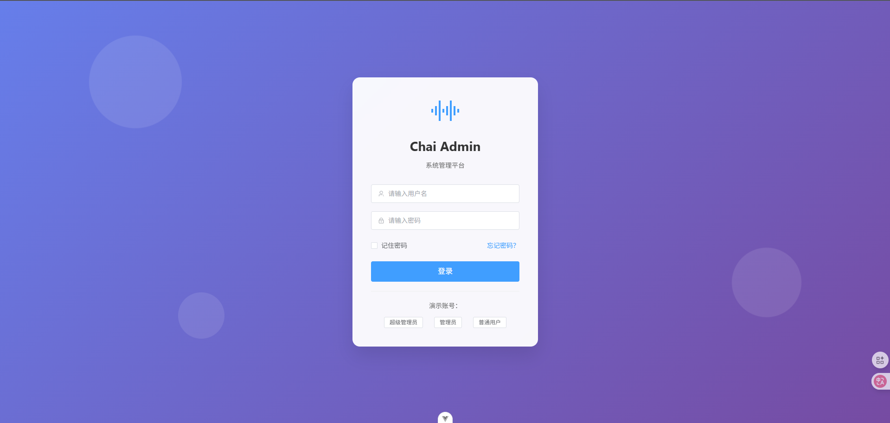
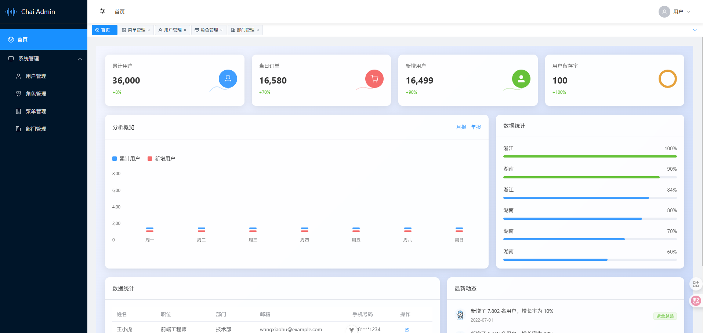
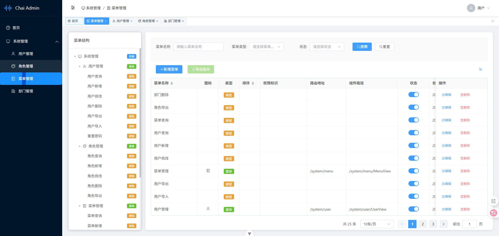
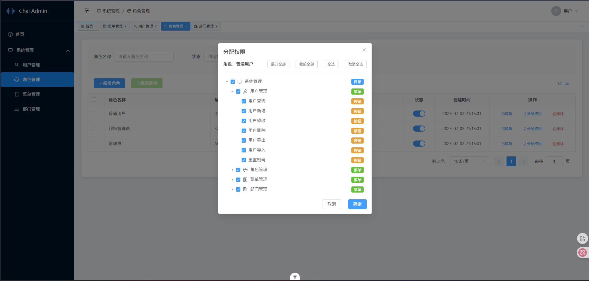
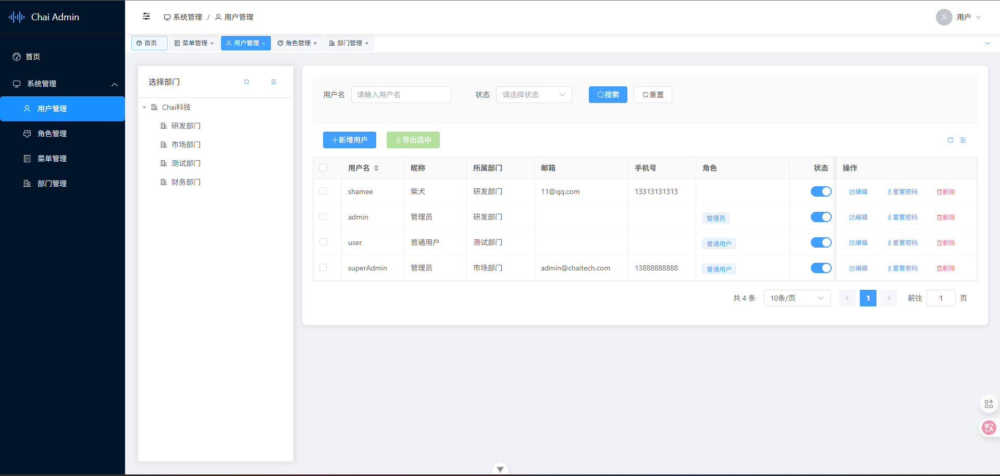

<div align="center">
  
  <h1>Chai Vue3 Element</h1>
  <p>基于 Vue 3 + Element Plus 的现代化后台管理系统。基本框架：Vue3, Element Plus, TypeScript, Vite, Pinia, Lodash......</p>
</div>

**欢迎各位大佬指正和建议！** 如果您发现了问题或有更好的实现方案，请不吝赐教。


### 配套后端代码：
Gitee： [chai-admin-service](https://gitee.com/shamee/chai-admin-service)  
Github：  [chai-admin-service](https://GitHub.com/Shamee99/chai-admin-service)


## ✨ 特性

- 🚀 **最新技术栈**：基于 Vue 3 + TypeScript + Vite 构建
- 🎨 **现代化 UI**：使用 Element Plus 组件库，界面美观易用
- 📱 **响应式设计**：完美适配桌面端和移动端
- 🔐 **权限管理**：完整的 RBAC 权限控制体系
- 📊 **数据表格**：集成 VXE Table，支持复杂表格操作
- 🎯 **TypeScript**：全面的类型安全保障
- 🔄 **状态管理**：使用 Pinia 进行状态管理
- 📦 **组件封装**：高度可复用的业务组件
- 🛠️ **开发体验**：完善的开发工具链和代码规范

## 🏗️ 技术栈

### 核心框架
- **Vue 3.5.17** - 渐进式 JavaScript 框架
- **TypeScript 5.8.0** - JavaScript 的超集，提供类型安全
- **Vite 7.0.0** - 下一代前端构建工具

### UI 组件库
- **Element Plus 2.10.3** - 基于 Vue 3 的桌面端组件库
- **@element-plus/icons-vue** - Element Plus 图标库
- **VXE Table 4.14.2** - 功能强大的表格组件

### 状态管理
- **Pinia 3.0.3** - Vue 的状态管理库
- **pinia-plugin-persistedstate** - Pinia 持久化插件

### 路由管理
- **Vue Router 4.5.1** - Vue.js 官方路由管理器

### 工具库
- **Axios 1.10.0** - HTTP 客户端
- **Lodash 4.17.21** - JavaScript 实用工具库
- **XLSX 0.18.5** - Excel 文件处理
- **File-saver 2.0.5** - 文件下载工具
- **Vuedraggable 2.24.3** - 拖拽组件

### 开发工具
- **ESLint** - 代码质量检查
- **Prettier** - 代码格式化
- **Vue DevTools** - Vue 开发者工具

## 🚀 快速开始

### 环境要求

- Node.js >= 18.0.0
- npm >= 8.0.0 或 yarn >= 1.22.0

### 安装依赖

```bash
# 克隆项目
git clone https://gitee.com/shamee/chai-vue3-element.git

# 进入项目目录
cd chai-admin

# 安装依赖
npm install

# 或使用 yarn
yarn install
```

### 开发环境

```bash
# 启动开发服务器
npm run dev

# 或使用 yarn
yarn dev
```

访问 http://localhost:5175 查看应用

### 构建部署

```bash
# 构建生产版本
npm run build

# 预览构建结果
npm run preview

# 类型检查
npm run type-check

# 代码检查和修复
npm run lint

# 代码格式化
npm run format
```

## 📁 项目结构

```
chai-admin/
├── public/                 # 静态资源
│   ├── favicon.ico
│   └── favicon.svg
├── src/
│   ├── api/               # API 接口
│   ├── assets/            # 静态资源
│   ├── components/        # 公共组件
│   │   └── common/        # 通用组件
│   ├── constants/         # 常量定义
│   ├── directives/        # 自定义指令
│   ├── layout/            # 布局组件
│   ├── router/            # 路由配置
│   ├── stores/            # 状态管理
│   ├── types/             # 类型定义
│   ├── utils/             # 工具函数
│   ├── views/             # 页面组件
│   │   ├── dashboard/     # 仪表盘
│   │   ├── system/        # 系统管理
│   │   │   ├── menu/      # 菜单管理
│   │   │   └── user/      # 用户管理
│   │   ├── login/         # 登录页面
│   │   └── error/         # 错误页面
│   ├── App.vue            # 根组件
│   └── main.ts            # 入口文件
├── .env                   # 环境变量
├── .env.development       # 开发环境变量
├── .env.production        # 生产环境变量
├── vite.config.ts         # Vite 配置
├── tsconfig.json          # TypeScript 配置
├── eslint.config.ts       # ESLint 配置
└── package.json           # 项目配置
```

## 🔧 功能模块

### 系统管理
- **用户管理**：用户的增删改查、角色分配、密码重置
- **菜单管理**：动态菜单配置、权限分配、菜单树管理
- **权限管理**：基于 RBAC 的权限控制体系

### 基础功能
- **登录认证**：用户登录、退出、会话管理
- **仪表盘**：数据概览、图表展示
- **个人中心**：个人信息管理、密码修改

### 通用组件
- **ChaiTable**：封装的数据表格组件，支持分页、排序、筛选
- **权限指令**：v-perms 权限控制指令
- **菜单树**：可展开折叠的树形菜单组件

## ⚙️ 配置说明

### 环境变量

项目支持多环境配置，主要环境变量说明：

```bash
# API 基础路径
VITE_API_BASE_URL=http://localhost:8000/api

# 是否开启代理
VITE_USE_PROXY=true

# 代理目标地址
VITE_PROXY_TARGET=http://localhost:8000

# 服务器端口
VITE_PORT=5175

# 是否自动打开浏览器
VITE_OPEN_BROWSER=true
```

### 代理配置

开发环境下，项目配置了 API 代理，将 `/api` 开头的请求代理到后端服务器。

### 相关截图
登录页：

首页：

菜单管理：

角色管理：

用户管理：


## 🤝 贡献指南

欢迎提交 Issue 和 Pull Request！

### 开发规范

1. 使用 TypeScript 进行开发
2. 遵循 ESLint 和 Prettier 代码规范
3. 提交前请运行 `npm run lint` 检查代码
4. 提交信息请遵循 [Conventional Commits](https://conventionalcommits.org/) 规范

### 提交步骤

1. Fork 本仓库
2. 创建特性分支 (`git checkout -b feature/AmazingFeature`)
3. 提交更改 (`git commit -m 'Add some AmazingFeature'`)
4. 推送到分支 (`git push origin feature/AmazingFeature`)
5. 创建 Pull Request

## 📄 许可证

本项目基于 [MIT](LICENSE) 许可证开源。

## 🙏 致谢

感谢以下开源项目的支持：

- [Vue.js](https://vuejs.org/)
- [Element Plus](https://element-plus.org/)
- [Vite](https://vitejs.dev/)
- [TypeScript](https://www.typescriptlang.org/)
- [Pinia](https://pinia.vuejs.org/)

## 📝 项目说明

这是一个学习型项目，代码完全由博主手工编写，可能存在以下不足：

- 🤔 代码结构可能不够优雅
- 🐛 可能存在一些潜在的 bug
- 📚 技术实现方式可能不是最佳实践
- 🔧 部分功能还在持续完善中

**欢迎各位大佬指正和建议！** 如果您发现了问题或有更好的实现方案，请不吝赐教。

## 📞 联系方式

如有问题或建议，请通过以下方式联系：

- 提交 [Issue](https://gitee.com/shamee/chai-vue3-element/issues)
- 发送邮件至：793049488@qq.com

## 💡 学习交流

本项目主要用于学习和交流，如果您：

- 🎓 正在学习 Vue 3 + TypeScript
- 🔍 想了解后台管理系统的实现
- 🤝 希望一起交流前端技术

欢迎 fork 本项目，一起学习进步！

---

<div align="center">
  <p>如果这个项目对你有帮助，请给个 ⭐️ 支持一下！</p>
  <p><small>感谢每一位愿意花时间查看代码的朋友 ❤️</small></p>
</div>
